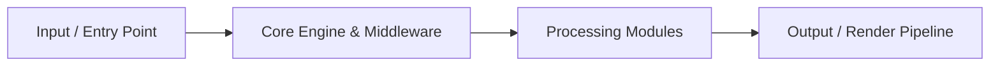

# Advanced-Content-Management-Platform
# Advanced-Content-Management-Platform

A modular content management solution designed to simplify digital publishing, content organization, administration, and website management while providing a foundation for further customization.

    


## 📖 Table of Contents

- [Overview](#-overview)
- [Architecture & Workflow](#-architecture--workflow)
- [Features](#-features)
- [Tech Stack](#-tech-stack)
- [Quick Start & Installation](#-quick-start--installation)
- [Environment Variables](#-environment-variables)
- [Project Structure](#-project-structure)
- [Scripts & Commands](#-scripts--commands)
- [Contributing](#-contributing)
- [License](#-license)


## 🚀 Overview

**Advanced-Content-Management-Platform** is an engineered solution built with Sass, SCSS, PHP.

- **Repository**: [`linuxsujith-lab/Advanced-Content-Management-Platform`](https://github.com/linuxsujith-lab/Advanced-Content-Management-Platform)
- **Default Branch**: `main`
- **Primary Runtime**: Sass (63.4%), SCSS (34.3%), PHP (2.2%)


## 🏗️ Architecture & Workflow




## ✨ Key Features

- ⚡ **High Performance Architecture**: Optimized execution lifecycle built on Sass.
- 🛡️ **Ground-Truth Data Integrity**: Built with resilient state validation and type-safe interfaces.
- 🧩 **Modular Subsystem Design**: Clean decoupling of UI components, service abstractions, and data transformations.
- 🎨 **Responsive & Intuitive Interface**: Engineered for frictionless user experience across desktop and mobile.
- 🚀 **Zero-Config Deployment Ready**: Pre-configured build scripts and modern containerization support.


## 💻 Tech Stack

| Technology | Category | Role |
| :--- | :--- | :--- |
| **Sass** | `other` | Core application framework & tooling |
| **SCSS** | `other` | Core application framework & tooling |
| **PHP** | `other` | Core application framework & tooling |


## ⚡ Quick Start & Installation

### Prerequisites

Ensure you have the verified runtime installed on your machine:
- **NPM** (v18+ or compatible runtime)
- **Git**

### Step-by-Step Setup

1. **Clone the repository:**
   ```bash
   git clone https://github.com/linuxsujith-lab/Advanced-Content-Management-Platform.git
   cd Advanced-Content-Management-Platform
   ```

2. **Install dependencies:**
   ```bash
   npm install
   ```

3. **Configure environment variables:**
   ```bash
   cp .env.example .env
   # Populate your secrets and keys in .env
   ```

4. **Launch development server:**
   ```bash
   npm run dev
   ```


## 📂 Project Structure

```plaintext
.
├── README.md
├── assets.zip
├── core.zip
├── index.php
├── installer
│   ├── css
│   │   ├── sass
│   │   ├── scss
│   │   ├── style.css
│   │   ├── style.css.map
│   │   ├── style.min.css
│   │   └── style.min.css.map
│   ├── database.sql
│   ├── fonts
│   │   ├── FontAwesome.otf
│   │   ├── fontawesome-webfont.eot
│   │   ├── fontawesome-webfont.svg
│   │   ├── fontawesome-webfont.ttf
│   │   ├── fontawesome-webfont.woff
│   │   ├── fontawesome-webfont.woff2
│   │   ├── ionicons.eot
│   │   ├── ionicons.svg
│   │   ├── ionicons.ttf
│   │   └── ionicons.woff
│   └── img
│       ├── background.png
│       ├── favicon
│       └── pattern.png
└── software_cmsdb1.sql
```


## 🤝 Contributing

Contributions, issues, and feature requests are welcome!

1. Fork the Project
2. Create your Feature Branch (`git checkout -b feature/AmazingFeature`)
3. Commit your Changes (`git commit -m 'feat: add amazing feature'`)
4. Push to the Branch (`git push origin feature/AmazingFeature`)
5. Open a Pull Request


## 📄 License

Distributed under the **MIT License**. See `LICENSE` for more information.

---

<div align="center">
  <sub>Engineered with precision by <a href="https://github.com/linuxsujith-lab/Advanced-Content-Management-Platform">linuxsujith-lab/Advanced-Content-Management-Platform</a></sub>
</div>
